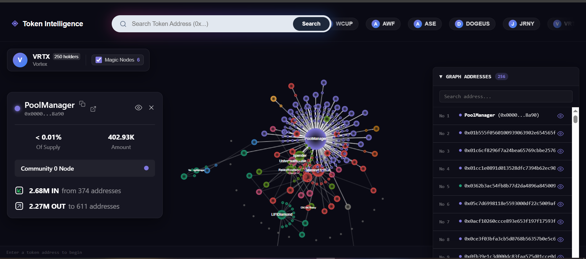

# Token Intelligence



Token Intelligence is a modern data engineering and analytics platform built to ingest, model, and visualize blockchain token transfers. It helps analysts detect **token wealth concentration**, **coordinated launcher/dev bundling**, **airdrop distributions**, and **suspicious wallet connectivity networks (wash-trading, hub-and-spoke flows)**.

The platform is powered by a high-performance stack: **PostgreSQL** for storage and indexing, **dbt-postgres** for modular data modeling, a **FastAPI** backend, and an interactive **React/Vite** frontend.

View [Dashboard](https://token-intelligence.onrender.com/)
---

## 🖥️ What the Frontend Looks Like & What it Displays

The frontend dashboard provides a comprehensive, interactive workspace divided into several specialized panels:

### 1. Token Selection & Discovery Sidebar
* **Token Directory**: A sidebar listing all tracked tokens across various EVM chains (Ethereum, BSC, Base, Arbitrum, Optimism).
* **Token Search & Filter**: Filter tokens by name, symbol, address, or network.

### 2. High-Level Metrics (Stats Bar)
* **Total Supply & Holder Count**: Displays the circulating supply and count of unique addresses holding the token.
* **Concentration Score**: A quick risk assessment (`Highly Concentrated`, `Concentrated`, `Moderate`, or `Healthy`) based on the Gini Coefficient and top-holder percentages.

### 3. Distribution & Concentration Analytics
* **Gini Coefficient**: Displays a score between `0.0` (perfect equality) and `1.0` (maximum inequality) showing how evenly the token supply is distributed.
* **HHI (Herfindahl-Hirschman Index)**: Measures market concentration; higher values indicate a monopoly/oligopoly among a few wallets.
* **Accumulation Metrics**: Displays what percentage of total supply is controlled by the **Top 10** and **Top 50** holders.

### 4. Interactive Top Holders List
* **Holder Profiles**: A table listing the top wallets sorted by balance and percentage of total supply.
* **Wallet Classification**: Automatically labels addresses as **Whale** (>=1% supply), **Mid** (>=0.1%), or **Retail** (<0.1%) based on holdings.

### 5. Launch-Day Bundling & Airdrop Detector
* **Exchange Hub Visualizer**: Identifies the primary funding sources (centralized/decentralized exchange wallets) used to launch the token.
* **Airdrop Timeline**: Lists batch distributions sent to many unique wallets in a single transaction.
* **Dev/Launcher Bundles**: Flags coordinated bundling events where tokens were transferred from a hub to multiple unique wallets in a tight block window (specifically within the first **2 hours** of token launch).

### 6. Interactive Wallet Forensics & Connection Graphs
* **Wallet ego-network**: Input any wallet address to visualize its 1-hop inbound and outbound transaction connections.
* **Deep Network Analysis (v2 Page)**:
  * **Louvain Community Detection**: Color-coded nodes grouped into network communities.
  * **Centrality Metrics**: Evaluates wallets based on **PageRank**, **In/Out Degree**, and **Betweenness Centrality** (identifying high-traffic "bridge" wallets).
  * **Relay Wallets**: Identifies intermediary wallets routing transfers between other parties.
  * **Suspicious Patterns**: Automatically flags structural anomalies such as **wash trades**, **circular flows**, and **hub-and-spoke networks**.

---

## 🛠️ Architecture & Data Stack

```
                        ┌──────────────────┐
                        │ Blockchain Node  │ (EVM chains)
                        └────────┬─────────┘
                                 │ Ingest
                                 ▼
                        ┌──────────────────┐
                        │ Raw PostgreSQL   │ (Transaction Logs)
                        └────────┬─────────┘
                                 │
                                 │ dbt run (Data Modeling)
                                 ▼
                        ┌──────────────────┐
                        │ Marts PostgreSQL │ (Refined Tables)
                        └────────┬─────────┘
                                 │
                                 │ SQLAlchemy / SQL Queries
                                 ▼
                        ┌──────────────────┐
                        │ FastAPI Backend  │ (Analytics Engine)
                        └────────┬─────────┘
                                 │
                                 │ JSON API
                                 ▼
                        ┌──────────────────┐
                        │  React Frontend  │ (Vite / D3 Graphs)
                        └──────────────────┘
```

* **Storage & Compute**: PostgreSQL stores raw blockchain events and serves fast queries on materialized analytics tables.
* **Transformation Layer**: dbt structures raw transfer logs into clean, deduplicated, and chain-specific transaction tables.
* **Serving Layer (FastAPI)**: Computes graph metrics (PageRank, Betweenness), runs community detection algorithms, and exposes endpoints.
* **Presentation Layer (React + Vite)**: Dynamic, interactive D3-based network graphs and analytics tables.

---

## 🚀 Getting Started

### 1. Data Transformation (dbt)
Run the analytical dbt pipeline to compile raw tables into production-ready marts:
```bash
cd dbt_model
dbt deps
dbt run
```

### 2. Running the API Backend
Configure database environment variables in `Dashboard/backend/.env` and start the FastAPI dev server:
```bash
cd Dashboard/backend
pip install -r requirements.txt
uvicorn api.main:app --reload
```

### 3. Running the Frontend
Install dependencies and run the Vite development server:
```bash
cd Dashboard/frontend
npm install
npm run dev
```
